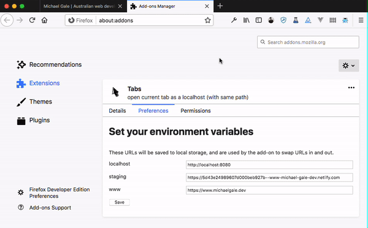

# Tabs (need better name)

A browser extension (currently Firefox-only). Open current tab as a localhost (with same path / queries, etc) 

👆 Gif explains better than my bad words

## How it works

This is not a *published* extension, but there is a signed/packaged release available at [https://github.com/miclgael/tabs/releases/](https://github.com/miclgael/tabs/releases/)

Supports Firefox + Firefox For Android v57+

**If you're developing..**

You can load the extension in debug mode. Navigate to [about:debugging#/runtime/this-firefox](about:debugging#/runtime/this-firefox). From there you can load it as a temporary add-on by opening the manifest file.

## Using the add-on

Once installed, you can right-click any open tab to find a new "Tabs" menu, somewhere at the bottom of the list.

You should go to the Options page, and set up your development URLs.

There is no checking or conversion of these strings, so make sure *DO* include a protocol, but *DON'T* include a trailing `/` on your URLs.

✅ Good: `http://localhost:8888`  
🚫 Bad: `localhost:8888/`

## Contributing

I would really like your help with:

- Developing a Chrome version
- Making these docs more understandable
- Bug fixes
- Testing / writing unit tests

Please read [CONTRIBUTING.md](CONTRIBUTING.md) for details on the code of conduct, and the process for submitting pull requests. 

## Versioning

I use [SemVer](http://semver.org/) for versioning. For the versions available, see the [tags on this repository](https://github.com/miclgael/tabs/tags). 

## Authors

* **Michael Gale** - *maintainer* - [miclgael](https://github.com/miclgael)

See also the list of [contributors](https://github.com/miclgael/tabs/contributors) who participated in this project.

## License

This project is licensed under the MIT License - see the [LICENCE](https://github.com/miclgael/tabs/blob/master/LICENCE) file for details

## Acknowledgements

Modified version of the "Menus" example from [MDN Web Extensions Examples](https://github.com/mdn/webextensions-examples)
